# The Open Network (TON) Grant Delivery Report

Project Repository: [the-open-network](https://github.com/XP-NETWORK/xp-the-open-network/)

<hr>

## `Milestone 1` — Smart Contract Development

Began: April, 1st, 2022

Finished: May, 9th, 2022

| # | Deliverable | Proof |
|-|-|-|
|1| We researched Ton NFT standards |[TIP-62](https://github.com/ton-blockchain/TIPs/issues/62)<br/>[TIP-64](https://github.com/ton-blockchain/TIPs/issues/64)|
|2| We developed for Native NFTs: <br/>+ Freeze<br/>+ Unfreeze |<br/>+ [Freeze](https://github.com/XP-NETWORK/xp-the-open-network/blob/b019727c7d9a48c299ed948aec93796011029997/src/contracts/bridge.ts#L179-L193)<br/>+ [Unfreeze](https://github.com/XP-NETWORK/xp-the-open-network/blob/b019727c7d9a48c299ed948aec93796011029997/src/contracts/bridge.ts#L153-L177)|
|3| We developed for wrapped NFTs:<br/>+ Mint <br/>+ Burn |<br> + [Minting](https://github.com/XP-NETWORK/xp-the-open-network/blob/b019727c7d9a48c299ed948aec93796011029997/src/contracts/bridge.ts#L99-L133)<br/>+ [Burning](https://github.com/XP-NETWORK/xp-the-open-network/blob/b019727c7d9a48c299ed948aec93796011029997/src/contracts/bridge.ts#L135-L151)|
|4| We implemented withdrawing<br/> the TX fees on the target chain in native tokens|+ [Withdrawing](https://github.com/XP-NETWORK/xp-the-open-network/blob/b019727c7d9a48c299ed948aec93796011029997/src/contracts/bridge.ts#L219-L240)|

<hr>

## `Milestone 2` — Smart Contract Development

Began: May, 10th, 2022

Finished: May, 26th, 2022 (2 weeks ahead of schedule)

| # | Deliverable | Proof |
|-|-|-|
||We have developed smart contracts that can:||
|5|Trust the multisig of the bridge oracle validators|+ [Code](https://github.com/XP-NETWORK/xp-the-open-network/search?q=check_signature)|
|6|Whitelist NFT smart contracts|+ [Code](https://github.com/XP-NETWORK/xp-the-open-network/blob/91bffbcc4d884c8bc630599557bfb41a964a3be1/func/bridge.func#L177)|
|7|+ Pause<br/>+ Unpause<br/>for maintenance or if compromised|+ [Pause](https://github.com/XP-NETWORK/xp-the-open-network/blob/91bffbcc4d884c8bc630599557bfb41a964a3be1/func/bridge.func#L195)<br/>+ [Unpause](https://github.com/XP-NETWORK/xp-the-open-network/blob/91bffbcc4d884c8bc630599557bfb41a964a3be1/func/bridge.func#L213)<br/><br/>|
|8|Reimburse the bridge validators their expenses|+ [Code](https://github.com/XP-NETWORK/xp-the-open-network/blob/main/func/bridge.func#L126-L156)|

<hr>

## `Milestone 3` — Testing & Documenting

Began: May, 26th, 2022

Finished: June, 20th, 2022 (10 days ahead of schedule)

| # | Deliverable | Proof |
|-|-|-|
|1|Inline Documentation|+ [bridge](https://github.com/XP-NETWORK/xp-the-open-network/blob/main/func/bridge.func)<br/>+ [burner](https://github.com/XP-NETWORK/xp-the-open-network/blob/main/func/burner.func)|
|2|Functional Tests with min 85% code coverage|+ [Link](#functional-tests)|
|3|Deployed in the testnet environment|+ [burner contract](https://testnet.tonscan.org/address/kQBkPHU3Fo4FEQGZYh6a-4SbjqaTfA6wfMDcyT-U5TCN__jC)<br/>+ [bridge contract](https://testnet.tonscan.org/address/kQBHIUR8NXBPZM6UZsgn5sBhFunoLvCJZteoj_6SUJcIjPoY)<br/>+ [collection](https://testnet.tonscan.org/address/EQBCZps88OUB5o2bGObx_2e002s3BtLp4Gq27NF3fqlRMKdJ)|
|4|Tested the functionality:|+ [minting](https://testnet.tonscan.org/tx/985319000001:UNfD1lL5jXCTmu+unyO2KOvlmxjirLOMTkTkgqkhHJ0=:EQALnbCowLoBEVmvSGGYKOIYySPbLKeUDTWWsl0AmqqzApek)<br/>+ [freezing](https://testnet.tonscan.org/tx/985525000003:OT%2F0Pa0dB5vzhiFybrxYYHQiomlWD0JFGih2wPT4BPM=:EQD-y4PUC7N5Rr-9qJRDLe9PDu4-R_ieKfm0kPvqSgPQHsSe)<br/>+ [unfreezing](https://testnet.tonscan.org/tx/985674000003:x0GngVfN5e%2FNASW+vsSVvkzx796r4kbwB99cTbuxuik=:EQBHIUR8NXBPZM6UZsgn5sBhFunoLvCJZteoj_6SUJcIjEGS)<br/>+ [withdrwing](https://testnet.tonscan.org/tx/981042000001:oXNsZOZPos5X8kWXUwdyD+saAbgQpz87CDo%2FWyjVPHQ=:EQAxZV60jjRcLtENLjNv-4I4SjS1HBBdI1ilvzbUuXaHK3Pk)<br/>+ [whitelisting](https://testnet.tonscan.org/tx/980723000003:SPYrGao80FFol32ioFv9D0C+W91x290tl%2FUorcTcTeg=:EQBHIUR8NXBPZM6UZsgn5sBhFunoLvCJZteoj_6SUJcIjEGS)|


## Functional Tests

Test source code: https://github.com/XP-NETWORK/xp-the-open-network/blob/main/tests/bridge.ts

Running:
```
yarn test
```
Outcome:
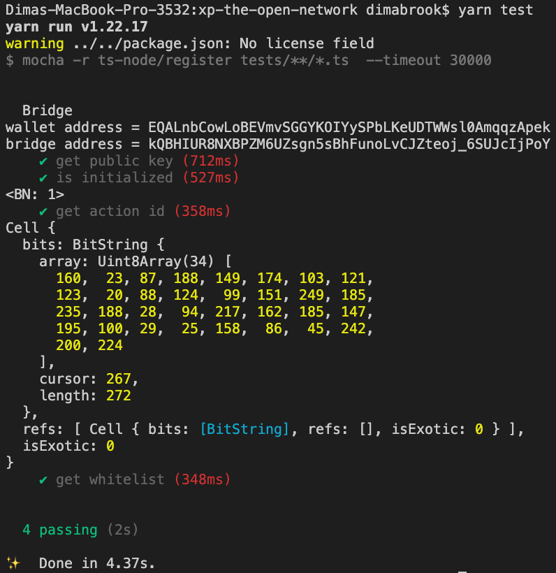

Test Source code:https://github.com/XP-NETWORK/xp-the-open-network/blob/main/src/test-nft.ts

Running:
```
yarn test-nft
```
Outcome:
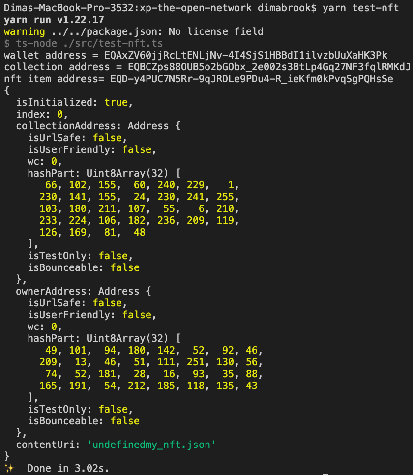

## `Milestone 4` — Integrating into the Live Bridge


| # | Deliverable | Proof |
|-|:-:|:-:|
|1| Developed validation logic for TON|[Link](#1-validation-logic)|
|2|Added TON to NFT-Indexer|[Indexer](#2-nft-indexer)|
|3|Implemented fee estimation for TON|[Proof](#3-fee-estimation)|
|4|Added TON to the bridge Explorer|[Explorer](#4-bridge-explorer)|
|5|Integrated TON RPC nodes|[RPC](#5-rpc-node-integration)|
|6|Added TON to the bridge UI|[UI](#6-bridge-ui)|
|7|Deployed Smart contracts on TON|[Testnet](#71-testnet-smart-contracts) \| [Mainnet](#72-mainnet-smart-contracts)|
|8|Adde TON to the JS Libabry|[XPJS](#8-javascript--typescript-library)|
|9|Added TON to the bridge Widget|[Widget](#9-bridge-widget)|
|10| TON wallet integration| [Wallets](#10-integrated-wallets)|
|11| Mainnet transactions|[Links](#11-mainnet-transactions)|

### 1. Validation Logic

TON-specific validation logic is most significant when bridging TO the TON chain. All the successful transactions prove the logic works as expected.

<center>

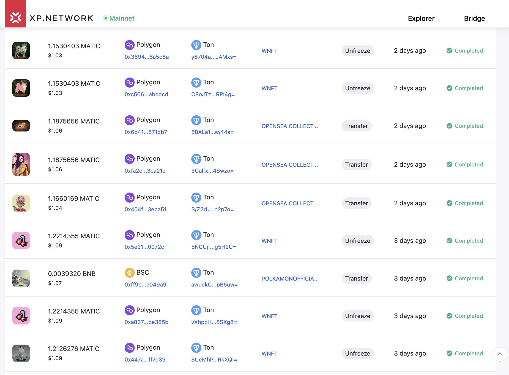

</center>

### 2. NFT-Indexer

NFT-Indexing allos retrieving NFT assets by a user address:

<center>

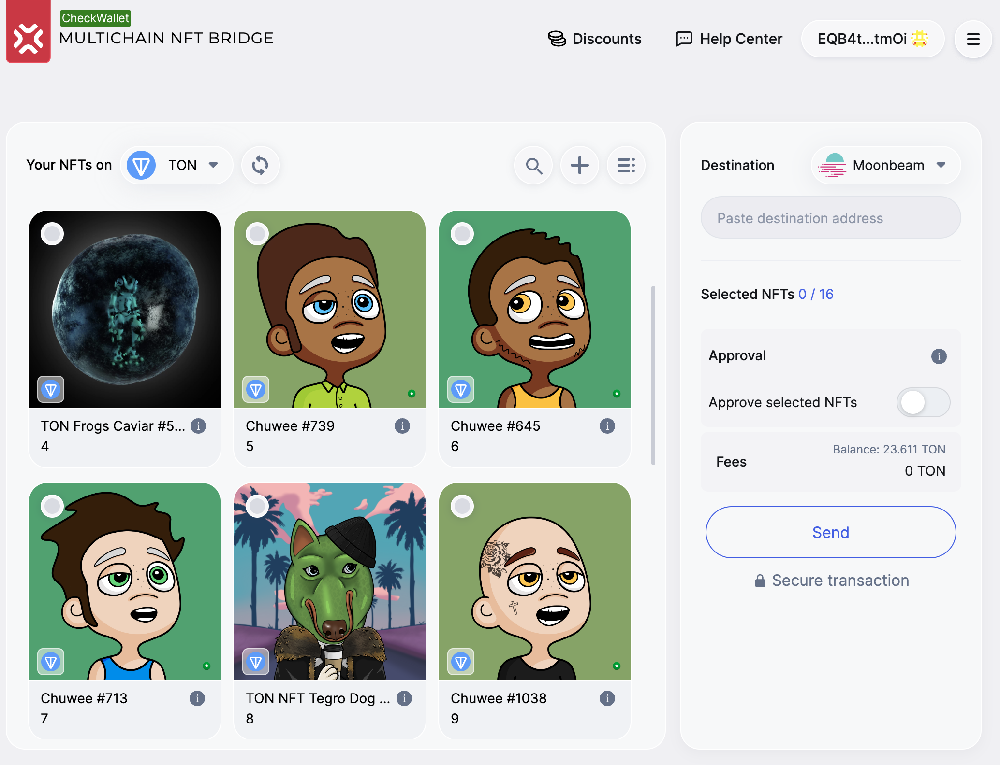

</center>

NFT-Indexing is also available as API:

https://nft-index.xp.network/index/nfts/27/EQB-Z_T8I5JjAT__ukAX2-yj4mIvbkC_89Q4eqlxbAyV1Gpi

<center>

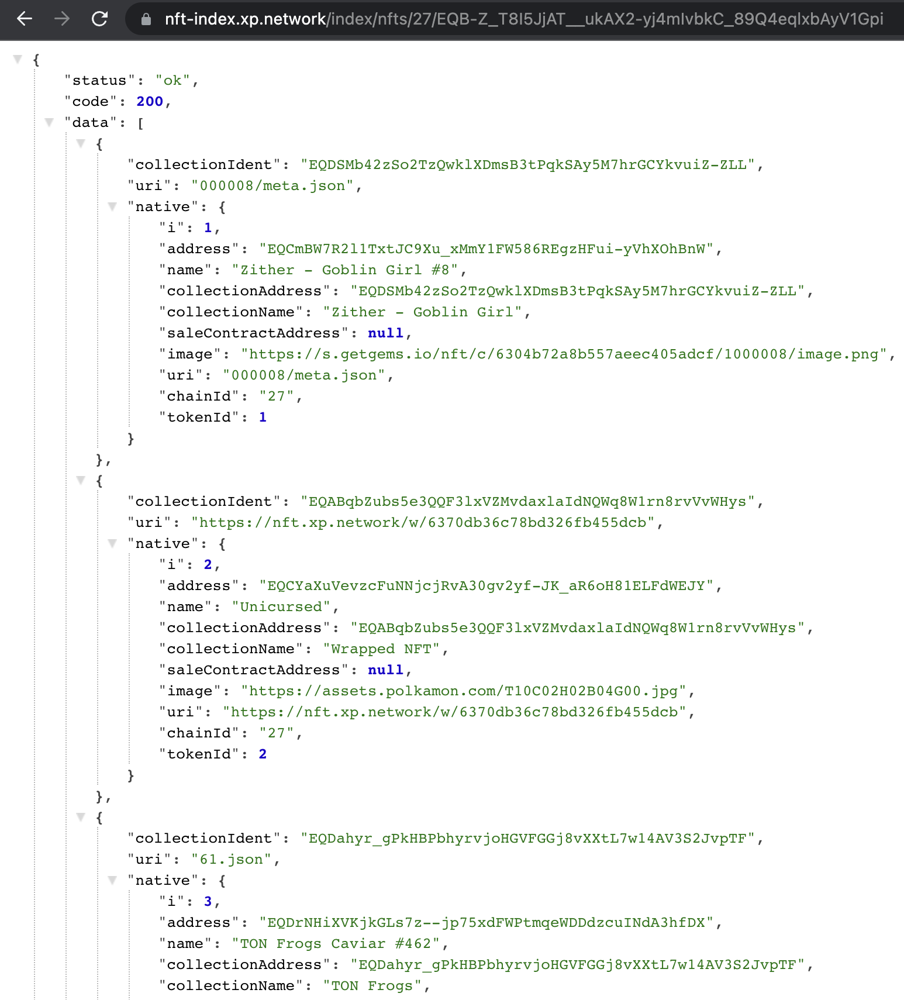

</center>

### 3. Fee Estimation

The target chain transaction fee is estimated & paid in the native TON tokens.

<center>

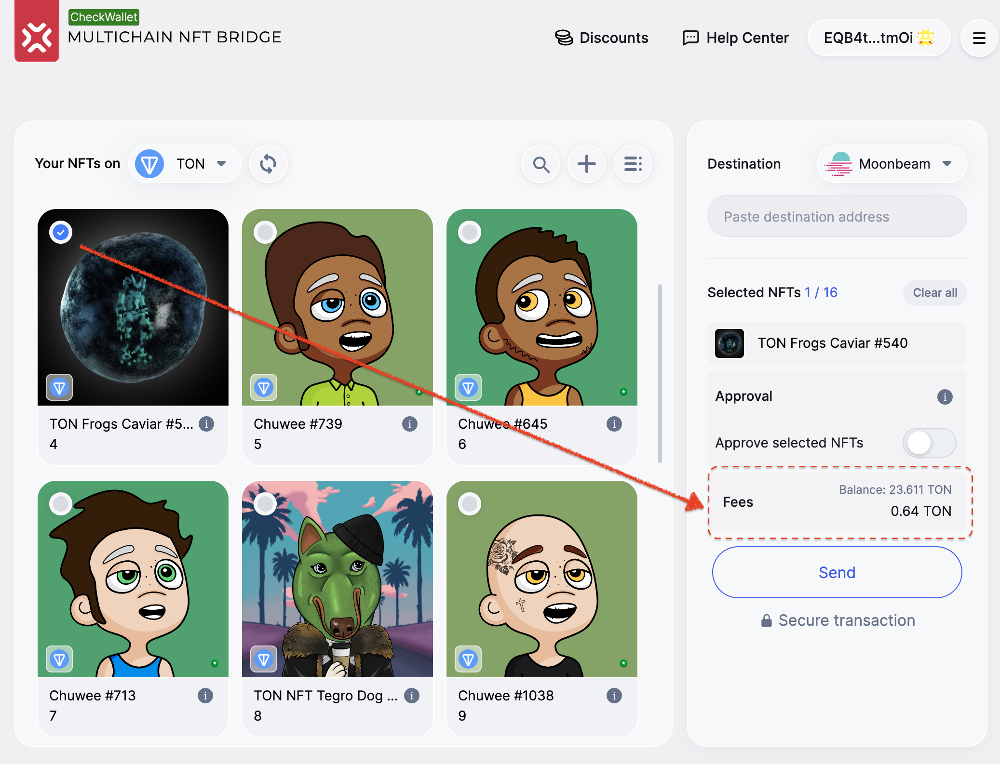

</center>

### 4. Bridge Explorer

Explorer allows tracking NFT transfers between blockchains. Every explorer transaction contains links to the original & destination transactions.

<center>

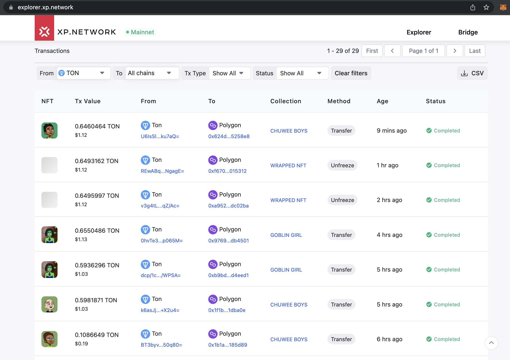

</center>

### 5. RPC Node Integration

TESTNET: https://testnet.toncenter.com/api/v2/jsonRPC

MAINNET: https://toncenter.com/api/v2/jsonRPC
### 6. Bridge UI

TON is added as a chain of departure

<center>

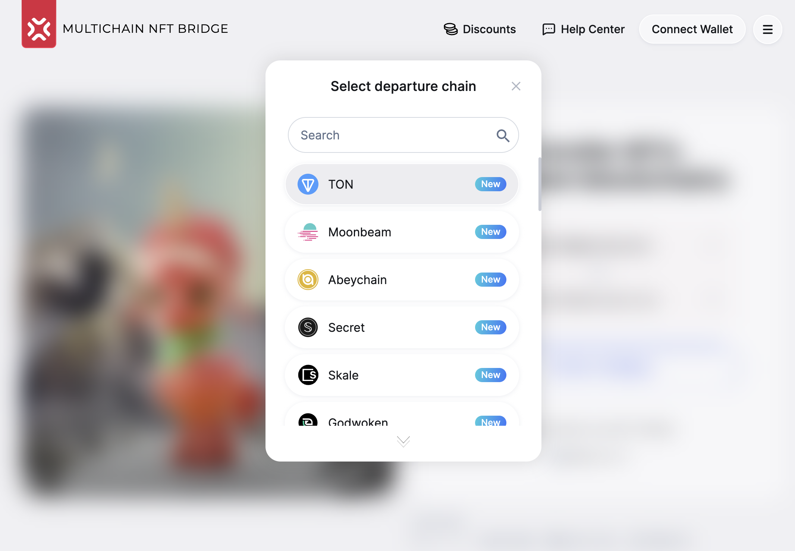

</center>

TON is added as a chain of destination

<center>

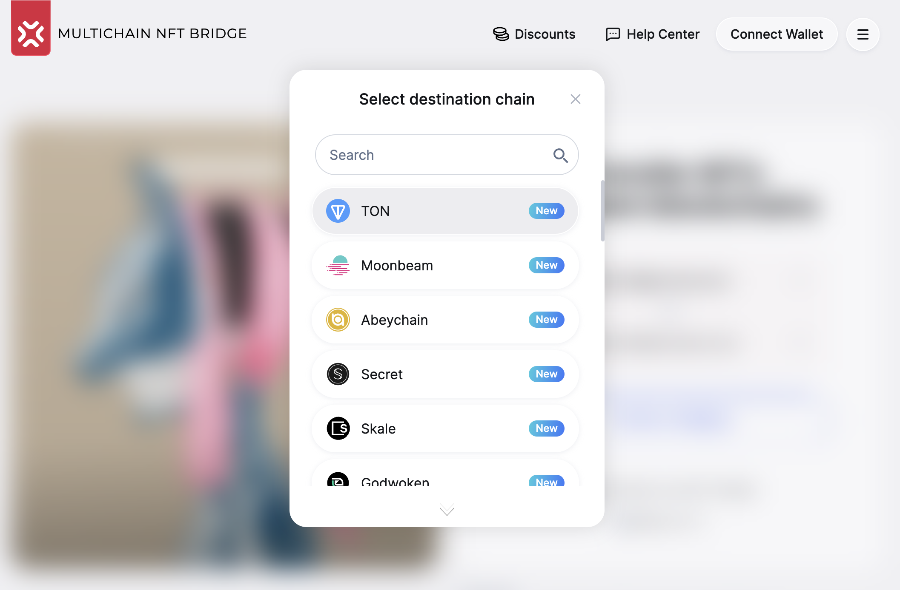

</center>

### 7.1 Testnet Smart Contracts

|Contract name|Contract Address|
|:-:|:-:|
|bridgeAddr| kQB2Z2E1hONMjdPeT_TR9Z_er9BSYlLJ2b19WQCFZRm9EkdH|
|burnerAddr| kQDsnLX5GSPtnP4rmqcyQOk2oo9lRPZlT3DunnO6OLITQSVl|
|xpnftAddr| EQDxXt6uNCbuqHY5Kmccwj9qflFzUbkiHtS3IFAbcqxpH0XM|


### 7.2 Mainnet Smart Contracts

7.2.1 STAGING Mainnet 

|Contract name|Contract Address|
|:-:|:-:|
|bridgeAddr|kQD3Fic8toRl0SIMswto8wmy5H41CDZUGAIyIK95Al5BBUiX|
|burnerAddr|kQBCnW4TO466p7YzKGZebnsylUSHTyxTKuwMDXo5JEQbIEOF|
|xpnftAddr|EQCgk1I2zujGrXaNXnWZEtFD93tSKNjvRfqKV0xp7EswHgw9|

7.2.2 PRODUCTION Mainnet 

|Contract name|Contract Address|
|:-:|:-:|
|bridgeAddr|kQAhH1me417YvScu9Rn8BXjsW_9HcalciG5LmCDT04HMJt6L|
|burnerAddr|kQDuSGRY8g6TCLC4QhlhqgLr4G_nNXTGHoXy38Mwxx-r1aGY|
|xpnftAddr|EQABqbZubs5e3QQF3lxVZMvdaxlaIdNQWq8W1rn8rvVvWHys|

### 8. JavaScript / TypeScript Library

https://github.com/XP-NETWORK/xpjs/search?q=ton

### 9. Bridge Widget

Widget allows embedding the bridge UI in any frontend.

<center>

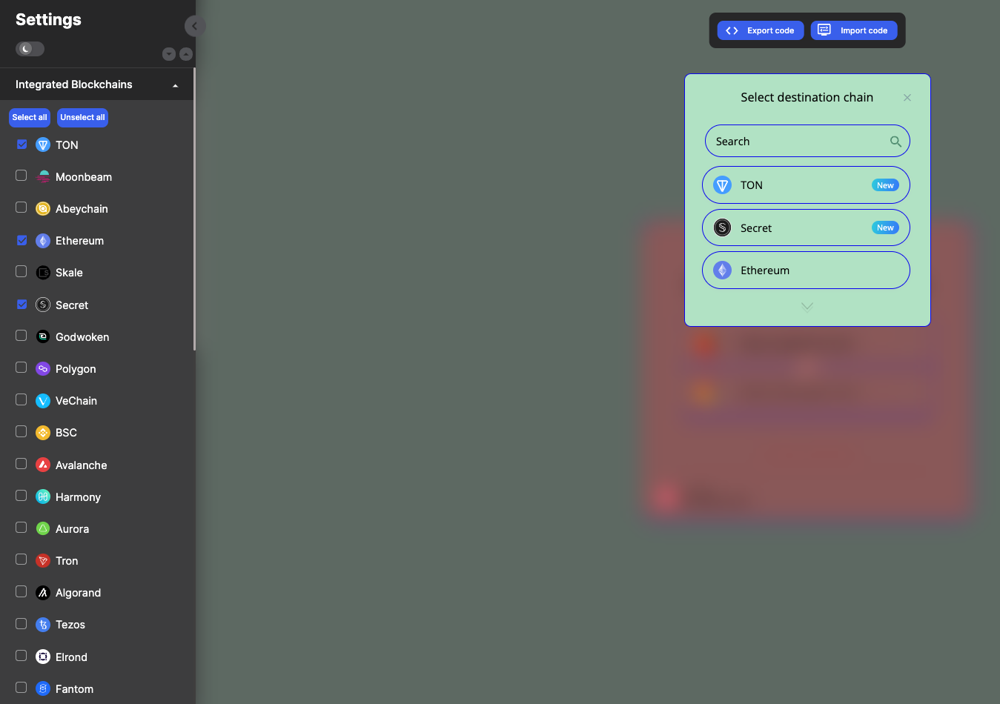

</center>

<center>

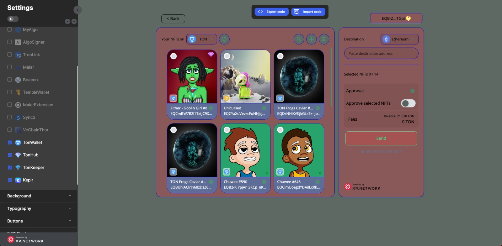

</center>

### 10. Integrated Wallets

The bridge users can sign transaction on TON with:
- Tonkeeper
- Tonhub
- TON Wallet

<center>

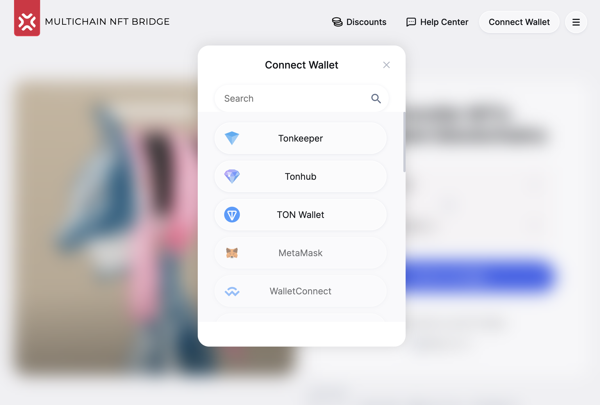

</center>

### 11. Mainnet Transactions

--------------- FROM TON ---------------

TON -> : https://tonscan.org/tx/by-msg-hash/0d8r9JR6XveiCN8r7N60IHVh5FdCkSl2XZUWdT8n0rk=

-> POLYGON: https://polygonscan.com/tx/0x2a7c30ca45ea7c4334601bb35163a32295a03aa7aa37a404e3bce2c87e968bc7


TON -> : https://tonscan.org/tx/by-msg-hash/nJnI3fDJ4/8O/SzFDDqpfRToTUZIPh1I+P75paikfOo=

-> BSC : https://bscscan.com/tx/0x02427f8c02c5abafe49b972c7dd62b98ea81f16f26d6e83d0ab8e19875a51975


--------------- TO TON ---------------

IoTeX -> : https://iotexscan.io/tx/0x04319c8349197ef08d1d28c4b5136fe5f7a55dc79d30c7f18a10666b684a8898

-> TON : https://tonscan.org/tx/by-msg-hash/Zh11JLUar8eRY8PVdwg1Ak/9rKm7Vqx3Ud01uaSWf+U=


Polygon -> : https://polygonscan.com/tx/0xec65da4ecbaf41c53f7c80cd6c4c4272a4e96f4d5156995d5e485f7e77321c11

-> TON : 


